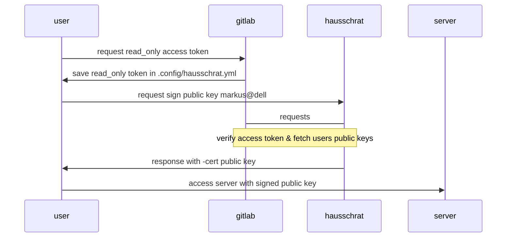

# hausschrat

The simplest SSH CA I can think of.

# design

Nowadays it's wide spread to save your public ssh keys in SCM Tools like GitLab, Gitea, Github etc.  
So why not use this source for your SSH CA?  
Most companies self-hosted a SCM Tool already and possible also bind it to a directory. When the linux server are also bind to the same directory - awesome. That are perfect conditions, because you even don't need to orchestrate the users to all your servers.    
You only need to glue things together. Here comes _hausschrat_ to play.

A user needs to create an access token in their SCM Tool with `read_user` permissions only. With this access token, _hausschrat_ can verify the user, fetch the users belonging public key, sign them and response with the certificate.



# Documentation

Take a look at `docs/src/` folder or read it online: `https://hausschrat.eu`

# CLI - request a certificate

Users just needs a `~/.config/hausschrat.yml` file.

```yml
default:
  server: https://localhost:8080 # hausschrat backend
  verify_ssl: False
  scm_url: https://git.osuv.de 
  api_token: ... # go to your scm tool and create a `read_user` access token.
  user: some_user
  key: some_key_name
  expire: +5h
  cert_file: ~/.ssh/test-cert.pub 
```

```shell
$ hausschrat
start issuing certificate for default
done
```

# SCM

| **host** | **category** |
| --- | --- |
| [https://git.osuv.de/m/hausschrat](https://git.osuv.de/m/hausschrat) | origin |
| [https://gitlab.com/markuman/hausschrat](https://gitlab.com/markuman/hausschrat) | pull mirror |
| [https://github.com/markuman/hausschrat](https://github.com/markuman/hausschrat) | push mirror |